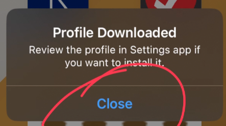
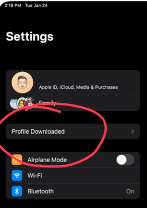
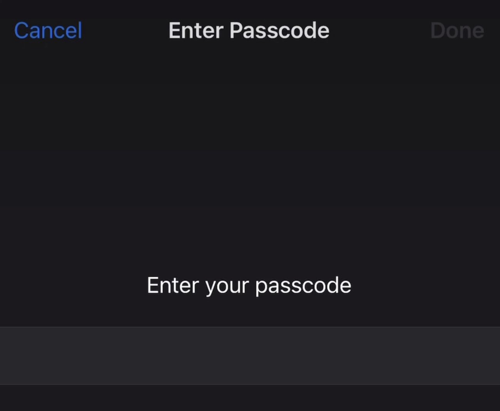
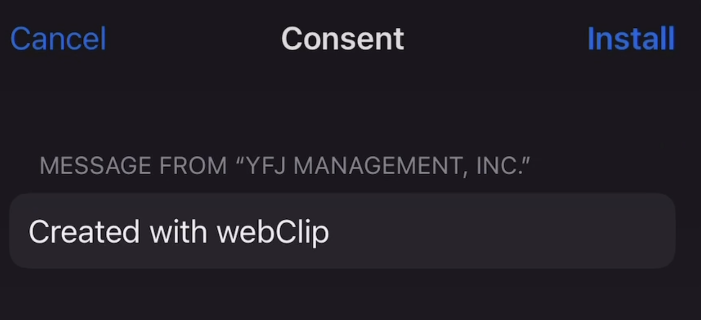
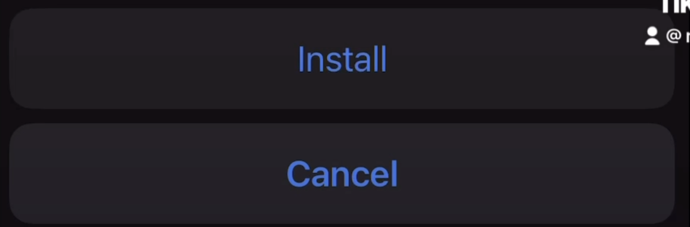

# iOS Install

!!! info "Differences from 'Regular' app"

    Due to the nature of the beta test phases, iOS has a different
    way to install rather than the 'traditional' App Store download.
    
    Follow the instructions below to install the Reggi Beta.

## Download Profile
    
Visit [LINK](https://example.com) on the device you want to install to

Click 'Allow' on the `This website is trying to download a configuration profile. Do you want to allow this` screen

{ width="30%"}

Click 'Close' on the `Profile Downloaded Review the profile in Settings app if you want to install it.` prompt
    
{ width="30%"}

You may be redirected to a blank white screen. If this is after you click 'Close', this is OK. Just exit the app and return to the home screen.

## Install Profile

1. Go to Settings app. Tap 'Profile Downloaded' near the top

    { width="20%"}

    If 'Profile Downloaded' does not appear, go to General -> VPN & Device Management

    { width="25%"}

    and find 'install file' under 'Downloaded Profile'

    { width="25%"}

    Tap on the profile

2. Click 'Install'

    { width="25%"}

3. Enter passcode, click install a few times

    |||
    |---|---|
    |1 |2 |
    |3 |4 

## Run Reggi Beta

Reggi Beta is now available on your Home Screen

{ width="10%"}